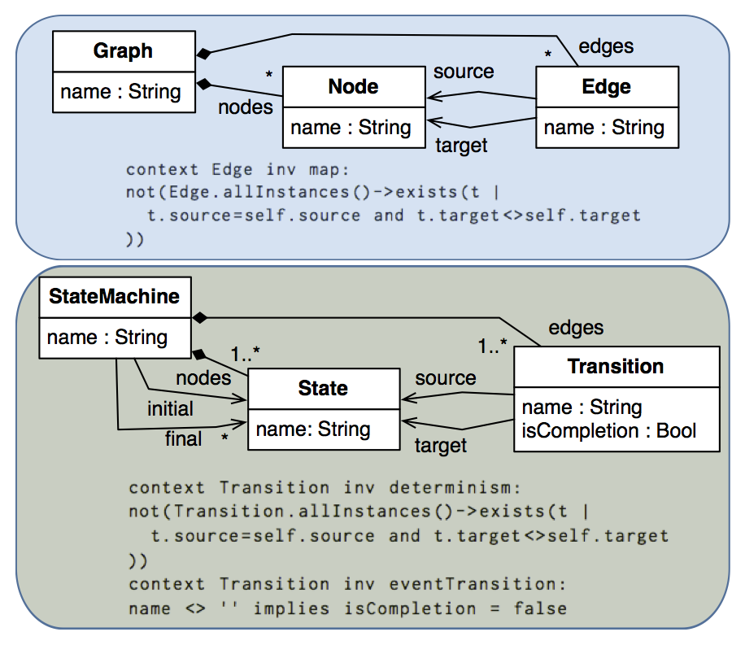
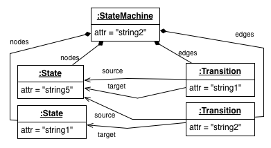
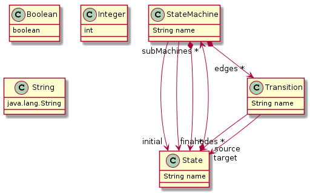
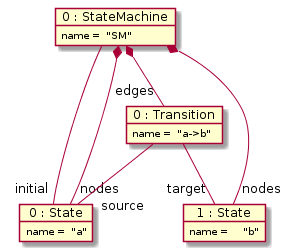
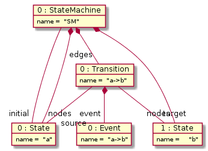
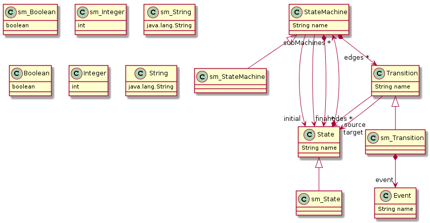
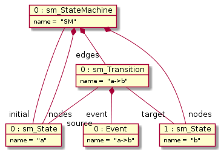

# Subtyping in MDE

## Configuration

To use the tool, download the [test Gradle project](https://github.com/mde-subtyping/web/tree/master/subtyping.tests). The usual structure of a test exercising the subtyping operation is as follows:

* Load the configuration properties for the solver (an example can be found [here](https://github.com/mde-subtyping/web/blob/master/subtyping.tests/src/test/resources/emf/model/type/sm/subtyping.properties)) indicating where Maude and the bounds to be used by the model finder:

		SolverProperties.loadPropertiesFile(propFilePath)
	
* Create an instance of the tool and configure it:

		def ModelTypeUtils tool = new ModelTypeUtils()
		// whether the software artifacts involved in solution (reuse metamodel, complement metamodels, etc) are to be persisted
		tool.persistent=true
		// folder where software artifacts will be stored 
		tool.outputPath="src/test/resources/emf/model/type/sm/generated/"
		// whether to use multiple subtyping or strict subtyping
		tool.multipleInheritance = false
	
* Invoke the tool by providing the metamodel specifications:

		tool.isOclConstrainedSubtypeOf(
			sMMPath, // path to subtype EMF metamodel (.ecore)
			sOcl, 	 // string containing OCL constraints for the metamodel above
			tMMPath, // path to supertype EMF metamodel (.ecore)
			tOcl	 // string containing OCL constraints for the metamodel above
		)
	
The tool will determine whether `(sMMPath,sOcl)` denotes a model subtype of the model type denoted by `(tMMPath,tOcl)`. This use case is illustrated below, in Section **Subtyping**. Note that any of the sets of OCL constraints may be empty (with the empty string `""`).

If the check fails, there are two main sources of incompatibilities: the model types denoted by the metamodels, and the OCL constraints. 
1. In the first case, the tool points at the source of the problem by showing the classes of the supertype metamodel `tMMPath` that are not extended by classes of `sMMPath`. That information is useful to assess the advantage of, for example, prunning the supertype metamodel by computing the effective metamodel w.r.t. a specific model management operation. 
2. In the second case, the tool will provide evidence that contradicts the compatibility property of `sMMPath` w.r.t. `tMMPath` in the form of a model represented in EMF notation (that is in XMI format), that invalidates a constraint in `tOcl`.

If the check succeeds, the tool guarantees that `(sMMPath,sOcl)` is a structural refinement of `(tMMPath,tOcl)`. Hence, any EMF model management operation that is defined for `(sMMPath,sOcl)` can be safely applied to models of `(tMMPath,tOcl)`. Going one step further, the tool also facilitates the reuse of such operation by automatically synthesizing an extension metamodel that can be substituted for `tMMPath` in the signature of the operation ensuring its application to models conforming to `(sMMPath,sOcl)` without any further change.	This use case is illustrated with a scenario below, in Section **Reuse of Model Management Operations**.

	

## Subtyping

In the example, we are using the metamodel specifications depicted below for defining graphs ([metamodel](https://github.com/mde-subtyping/web/blob/master/subtyping.tests/src/test/resources/emf/model/type/sm/graph.emf) and [OCL constraints](https://github.com/mde-subtyping/web/blob/master/subtyping.tests/src/test/resources/emf/model/type/sm/graph_ocl_mapProperty.use)) and deterministic state machines ([metamodel](https://github.com/mde-subtyping/web/blob/master/subtyping.tests/src/test/resources/emf/model/type/sm/sm.emf) and [OCL constraints](https://github.com/mde-subtyping/web/blob/master/subtyping.tests/src/test/resources/emf/model/type/sm/sm_ocl_det.use)), resp. The model types described by both metamodels are structurally similar in that they both describe languages of graphs.

On the one hand, the top metamodel specification characterizes the graph of a function defined over nodes. On the other hand, the bottom metamodel specification characterizes deterministic state machines where transitions can be triggered by an event (indicated in the *name* attribute of the transition) or are triggerless, e.g. they are completion transitions. 

The following test cases show how to use the tool to check that the state machine metamodel specification denotes a model subtype of the one denoted by the graph metamodel,
* using [strict subtyping (lines 11-30)](https://github.com/mde-subtyping/web/blob/master/subtyping.tests/src/test/groovy/metamodel/sm/ModelTypeUtils_OCL_tests.groovy)
* using [multiple subtyping (lines 32-52)](https://github.com/mde-subtyping/web/blob/master/subtyping.tests/src/test/groovy/metamodel/sm/ModelTypeUtils_OCL_tests.groovy)

In addition, if we consider non-deterministic state machines by removing the OCL constraint defining the deterministic condition from the state machine metamodel specification as instructed in [this test case (lines 54-72)](https://github.com/mde-subtyping/web/blob/master/subtyping.tests/src/test/groovy/metamodel/sm/ModelTypeUtils_OCL_tests.groovy) we obtain a non-deterministic state machine that does not satisfy the graph constraint, which is represented in object diagram notation as follows:

## Reuse of Model Management Operations

In this section, we are going to show how to reuse a model management operation - in this case, a model-to-text transformation with ATL - for a refinement version of the state machine metamodel. 

[Initial state machine metamodel](https://github.com/mde-subtyping/web/blob/master/subtyping.sm.atl/models/sm.emf) (**version 1**):

We have developed an [ATL transformation](https://github.com/mde-subtyping/web/blob/master/subtyping.sm.atl/trafo/sm.atl) that serializes a state machine conforming to the previous metamodel into the [format proposed by Martin Fowler](http://www.informit.com/articles/article.aspx?p=1592379&seqNum=3). This operation maps the state machine:

into

	events
	  a->b
	end
	
	state a
	  a->b => b
	end
	
	state b
	end

In a refinement of our DSL for state machines, we add an event as an explicit entity, produding a [new metamodel](https://github.com/mde-subtyping/web/blob/master/subtyping.sm.atl/extended/smEvent.emf) (**version 2**):

with the following constraint, ensuring the consistency of event names:

	context Transition
	inv event_consistency:
	not(self.event.oclIsUndefined) implies self.name=self.event.name

For which we can define state machines as follows:

The questions that we address next are:
* Can we reuse the model operation for compiling state machines that conform to **version 2** of the metamodel (as the one depicted above)? 
* If so, how can we do it?

Our subtyping operation assists us in determining that the **version 2** of the metamodel together with the OCL constraint is a refinement of **version 1** as shown [in this test case](https://github.com/mde-subtyping/web/blob/master/subtyping.tests/src/test/groovy/metamodel/sm/ModelTypeUtils_reuse_tests.groovy). 

The subtyping operation also synthesizes the [extended metamodel](https://github.com/mde-subtyping/web/blob/master/subtyping.sm.atl/extended/extension.ecore), depicted in class diagram notation below:

That can be used to rewrite the signature of the model management operation. In addition, as the subtyping operation had to apply some automatic renamings in order to avoid name clashes, we have to adapt the original model that conforms to **version 2** to the extension metamodel as shown in [this test case (testRetype_smEvent_asExtended)](https://github.com/mde-subtyping/web/blob/master/subtyping.tests/src/test/groovy/metamodel/sm/ModelTypeUtils_reuse_tests.groovy). This operation retypes the objects in the original model according to the renamings inferred by the subtyping operation: 

This model can be processed by the ATL transformation, after replacing the original metamodel with the synthesized extension metamodel. Note that the adaptation of the model is only mandatory when the set of class names in version 1 and the set of class names in version 2 are not disjoint. 

In case the renamings applied to the subtype metamodel in the extension model make the object type names different from those in the original subtype metamodel, the tool facilitates an adaptation from the extended metamodel to the original metamodel as shown in [the test case (testRetype_smEvent_asOriginal)](https://github.com/mde-subtyping/web/blob/master/subtyping.tests/src/test/groovy/metamodel/sm/ModelTypeUtils_reuse_tests.groovy). 
