Note: the contents of this README file are formatted in markdown. Feel free to change the extension `.txt` to `.md` and render it in HTML format in a markdown editor of your choice. The compiled version of the document in HTML has been included as well, facilitating the rendering of images.

# Software Artifact Submission for SLE'17

* Title: **Structural Model Subtyping with OCL Constraints**

## Abstract

 
Invoke the tool by providing the metamodel specifications:

	tool.isOclConstrainedSubtypeOf(
		sMMPath, // path to subtype EMF metamodel (.ecore)
		sOcl, 	 // string containing OCL constraints for the metamodel above
		tMMPath, // path to supertype EMF metamodel (.ecore)
		tOcl	 // string containing OCL constraints for the metamodel above
	)

The tool will determine whether `(sMMPath,sOcl)` denotes a model subtype of the model type denoted by `(tMMPath,tOcl)`. This use case is illustrated below, in [Section Subtyping](#Subtyping). Note that any of the sets of OCL constraints may be empty (with the empty string `""`).

If the check fails, there are two main sources of incompatibilities: the model types denoted by the metamodels, and the OCL constraints. 
1. In the first case, the tool points at the source of the problem by showing the classes of the supertype metamodel `tMMPath` that are not extended by classes of `sMMPath`. That information is useful to assess the advantage of, for example, prunning the supertype metamodel by computing the effective metamodel w.r.t. a specific model management operation. 
2. In the second case, the tool will provide evidence that contradicts the compatibility property of `sMMPath` w.r.t. `tMMPath` in the form of a model represented in EMF notation (that is in XMI format), that invalidates a constraint in `tOcl`.

If the check succeeds, the tool guarantees that `(sMMPath,sOcl)` is a structural refinement of `(tMMPath,tOcl)`. Hence, any EMF model management operation that is defined for `(sMMPath,sOcl)` can be safely applied to models of `(tMMPath,tOcl)`. Going one step further, the tool also facilitates the reuse of such operation by automatically synthesizing an extension metamodel that can be substituted for `tMMPath` in the signature of the operation ensuring its application to models conforming to `(sMMPath,sOcl)` without any further change.	This use case is illustrated with a scenario below, in Section [Reuse of Model Management Operations](#Reuse of Model Management Operations).

## Overview: content of the archive

This document explains how to download and configure a tool for testing structural model subtyping for metamodel specifications in MDE and for reusing (EMF) model management operations. The contents of the archive are as follows:
* [README.txt](./README.txt): this document
  * [Setup/installation guide](#Setup/installation-guide)
    * [Environment assumptions to use the tool](#Environment-assumptions-to-use-the-tool)
    * [macOS: Inspecting the test cases](#macOS-Inspecting-the-test-cases)
    * [Linux: inspecting the test cases](#Linux:-inspecting-the-test-cases)
    * [Linux (VirtualBox)](#Linux-(VirtualBox))
  * [Step-by-step instructions](#Step-by-step-instructions)
    * [Invoking the tool programmatically](#Invoking-the-tool-programmatically)
    * [Scenario 1: Structural subtyping (Subtyping)](#Scenario-1:-Structural-subtyping-(Subtyping))
    * [Scenario 2: Structural subtyping with OCL constraints (Subtyping, Multiple-Typing)](#Scenario-2:-Structural-subtyping-with-OCL-constraints-(Subtyping,-Multiple-Typing))
    * [Scenario 3: DSML evolution (Reuse, Partial Typing)](#Scenario-3:-DSML-evolution-(Reuse,-Partial-Typing))
    * [Scenario 4: Stepwise Simulation of Deterministic State Machines (Reuse, Dynamic Typing)](#Scenario-4:-Stepwise-Simulation-of-Deterministic-State-Machines-(Reuse,-Dynamic-Typing))
  * [License](#License)
  * [Credits](#Credits)

* [README.html](./README.html): this document in HTML format. Images are displayed.
* Tool usage illustrated in a number of test cases:
  * [main project](./subtyping.tests): contains the main test cases and shows how to invoke the tool programmatically, including 
    * how the tool supports structural subtyping with/without OCL constraints** for checking refinement between metamodel specifications, formed by a metamodel and well-formedness constraints in OCL;
    * **multiple model typing**;
    * an scenario on DSML evolution illustrating how the tool provides support for **partial model typing**;
    * an scenario on state machine simulation illustrating how the tool provides support for **dynamic model typing**.
  * [ATL transformation (evolution)](subtyping.sm.atl.evolution): ATL project containing the transformation needed to test the evolution scenario.
  * [ATL transformation (simulation)](subtyping.sm.atl.simulation): ATL project containing the transformation needed to test the simulation scenario.
* VirtualBox image based on Linux Ubuntu 15.04 (Vivid Vervet)

## Setup/installation guide

### Environment assumptions to use the tool

The tool has been tested `macOS 10.12.4 (Sierra)` and `Linux Ubuntu 15.04 (Vivid Vervet)`. A VirtualBox image with Linux Ubuntu 15.04 is available, as explained [below](#Linux (VirtualBox)). 

The base technology that is required to run the tool is as follows:

* [Java 1.8](https://docs.oracle.com/javase/8/docs/technotes/guides/install/install_overview.html)
* [Groovy 2.4](http://groovy-lang.org/download.html)
* [Gradle 4.0](https://gradle.org/install/)

If, in addition, you want to work from within [Eclipse Oxygen (Modelling Package)](http://www.eclipse.org/downloads/packages/eclipse-modeling-tools/oxygenr), you will need:

* [ATL](http://www.eclipse.org/atl/download/)
* [Groovy integration plugin](https://github.com/groovy/groovy-eclipse/wiki)
* [Gradle Buildship](https://marketplace.eclipse.org/content/buildship-gradle-integration)

### macOS: Inspecting the test cases

1. Install Eclipse Oxygen (Modelling package).
2. Install Gradle Buildship Integration 2.0 if it is not available.
3. Clone the git repository: `https://github.com/mde-subtyping/web.git`.
4. From Java perspective, import Gradle project using Gradle wrapper.
5. Select the project folder `subtyping.tests` in your git repository.
6. If prompted `Overwrite existing Eclipse project descriptors?`, choose `Overwrite`.

After that explore the test cases under `src/test/groovy`, which can be run as JUnit test cases.

### Linux: inspecting the test cases 

Follow the [numbered steps used on macOS](#Inspecting the test cases on macOS), and then

7. In each of the packages under the folder `src/test/resources`, edit the file `subtyping.properties` and change the following parameters as follows:

	maude.os=OS_LINUX
	maude.maudePath=src/test/resources/maude/maude.linux64 

8. Please check that the file `src/test/resources/maude/maude.linux64` is executable, or else modify the corresponding access permissions using `chmod`.

After that explore the test cases under `src/test/groovy`, which can be run as JUnit test cases.

### Linux (VirtualBox)

* User/password: ubuntu/reverse

## Step-by-step instructions

In the following subsections, we provide the examples used to illustrate the core contributions in the paper.

### Invoking the tool programmatically

The usual structure of a test exercising the subtyping operation is as follows:

* Load the configuration properties for the solver (an example can be found [here](./subtyping.tests/src/test/resources/emf/model/type/sm/subtyping.properties)) indicating where Maude is stored and the bounds to be used by the model finder:

		SolverProperties.loadPropertiesFile(propFilePath)

* Create an instance of the tool and configure it:

		def ModelTypeUtils tool = new ModelTypeUtils()
		// whether the software artifacts involved in solution (reuse metamodel, complement metamodels, etc) are to be persisted
		tool.persistent=true
		// folder where software artifacts will be stored 
		tool.outputPath="src/test/resources/emf/model/type/sm/generated/"
		// whether to use multiple subtyping or strict subtyping
		tool.multipleInheritance = false

* Invoke the tool by providing the metamodel specifications:

		tool.isOclConstrainedSubtypeOf(
			sMMPath, // path to subtype EMF metamodel (.ecore)
			sOcl, 	 // string containing OCL constraints for the metamodel above
			tMMPath, // path to supertype EMF metamodel (.ecore)
			tOcl	 // string containing OCL constraints for the metamodel above
		)

### Scenario 1: Structural subtyping (Subtyping) 

In this section, we show the expressivity of our structural subtyping operation (without OCL constraints) with respect to model typing [^Steel07] [^Guy12]. We compare our approach to model subtyping by considering their example with the following state machines:

[^Steel07]: Jim Steel, Jean-Marc Jézéquel. On model typing. Software and Ssytem Modeling 6, 4 (2007), 401-413.
[^Guy12]: Clement Guy, Benoît Combemale, Steven Derrien, Jim Steel, Jean-Marc Jézequel. On Model Subtyping. ECMFA 2012. 400-415.

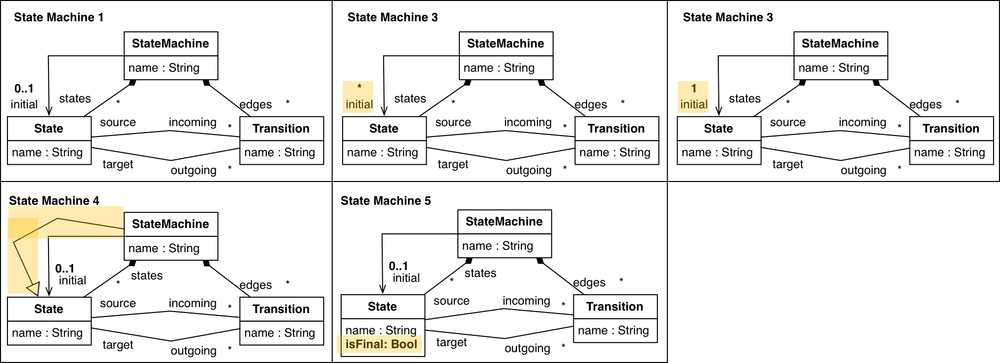

where changes have been highlighted. 

The test cases implementing the subtyping checks can be found [here](./fma/metamodel/subtyping/src/test/groovy/fma/metamodel/subtyping/utils/tests/test_sle17_sm_subtyping.groovy) and the results are summarized in the following table:

| subtypeOf | sm1 | sm2 | sm3 | sm4 | sm5 | 
|--|--|--|--|--|--|--|
| sm1 | true | true | false | false | false | 
| sm2 | false | true | false | false | false | 
| sm3 | true | true | true | false | false | 
| sm4 | true | true | false | true | false | 
| sm5 | true | true | false | false | true | 

### Scenario 2: Structural subtyping with OCL constraints (Subtyping, Multiple Typing)

In this section, we use the main example of the paper for illustrating how multiple typings can be applied to a metamodel at the classifier level, that is, a class of the subtype metamodel can be typed by more than one class in the supertype metamodel. The generalization of multiple typing at the metamodel level is supported by providing an extension metamodels for each different metamodel. However, as each such extension metamodel is linked to a different metamodel, which is usually defined for a given model management operation, we restrict ourselves to an example with one single model management operation.

In the example, we are using the metamodel specifications depicted below for defining graphs ([metamodel](./subtyping.tests/src/test/resources/emf/model/type/sm/graph.emf) and [OCL constraints](./subtyping.tests/src/test/resources/emf/model/type/sm/graph_ocl_mapProperty.use)) and deterministic state machines ([metamodel](./subtyping.tests/src/test/resources/emf/model/type/sm/sm.emf) and [OCL constraints](./subtyping.tests/src/test/resources/emf/model/type/sm/sm_ocl_det.use)), resp. The model types described by both metamodels are structurally similar in that they both describe languages of graphs.

On the one hand, the top metamodel specification characterizes the graph of a function defined over nodes. On the other hand, the bottom metamodel specification characterizes deterministic state machines where transitions can be triggered by an event (indicated in the *name* attribute of the transition) or are triggerless, e.g. they are completion transitions. 

[These test cases](./subtyping.tests/src/test/groovy/metamodel/sm/test_sle17_sm_example.groovy) show how to use the tool to check that the state machine metamodel specification denotes a model subtype of the one denoted by the graph metamodel:
* Using [strict subtyping (test_singleInheritance_isSubtypeOf_consistent)](./subtyping.tests/src/test/groovy/metamodel/sm/test_sle17_sm_example.groovy):
  * The tool generates the model binding **binding.xmi** containing bindings representing the possible multiple typings of classifiers in the subtype with classifiers of the supertype.
  * Subsequent **bindingX** files represent the strict typing solutions by order of recommendation prioritizing those with a better coverage of subtype classifiers with supertype classifiers, as explained in the paper. A strict subtyping solution *X* contains the following files:
    * *bindingX_reuse_mm.ecore*: extension metamodel for reusing model management operations;
    * *bindingX_subtype_uncovered.ecore*: classifiers of subtype that have not been covered (data types are always included);
    * *bindingX_supertype_uncovered.ecore*: classifiers of supertype that have not been covered (data types are always included);
    * *bindingX_virtual_mm.ecore*: extension metamodel used for the analysis of OCL constraints (supertype classifiers are abstract);
    * *bindingX.xmi*: subtypeOf relationships considered.
* Using [multiple subtyping (test_multipleInheritance_isSubtypeOf_consistent)](./subtyping.tests/src/test/groovy/metamodel/sm/test_sle17_sm_example.groovy):
  * In this case, the tool uses the initial binding solution containing all the inferred subtyping relationships and builds the extension metamodel using the construction developed in the paper, computing *binding0_virtual_mm.ecore* for checking the compatibility of OCL constraints and *binding0_reuse_mm.ecore* for reusing model management operations declared for the supertype.
  * The files *bindingX_subtype_uncovered.ecore* and *bindingX_supertype_uncovered.ecore* are generated as well.
  
Moreover, if we consider non-deterministic state machines by removing the OCL constraint defining the deterministic condition from the state machine metamodel specification as instructed in [this test case (test_singleInheritance_isSubtypeOf_inconsistent)](./subtyping.tests/src/test/groovy/metamodel/sm/test_sle17_sm_example.groovy) we obtain a non-deterministic state machine that does not satisfy the graph constraint, which is represented in object diagram notation as follows:

The counterexample in generated in the folder *temp/model*, where *temp* is the temporary folder specified in the corresponding *subtyping.properties* file. The counterexample is a model conforming to the virtual metamodel and can be *casted down* to the subtype as explained in the sections below. 

This last example also illustrates that the use of well-formedness constraints is optional in our tool. Additionally, [these test cases](./subtyping.tests/src/test/groovy/metamodel/sm/test_sle17_sm_event.groovy) demonstrate the usage of the possible combinations of OCL constraints with metamodels for checking structural subtyping.

### Scenario 3: DSML evolution (Reuse, Partial Typing)

In this section, we are going to show how to reuse a model management operation - in this case, a model-to-text transformation with ATL - for a modified version of the state machine metamodel. In this scenario, we discuss how to use the tool to reuse an ATL model transformation defined for a metamodel *v1* for models of a metamodel *v2* when the metamodel *v1* is not exactly a supertype of the metamodel *v2*. In addition, we illustrate that the ATL model transformation can be applied even if a model is only **partially typed** by the metamodel involved in the ATL transformation.

The steps involved in this scenario relating to our tool are fully automated in the test case [test_evolution_scenario](./subtyping.tests/src/test/groovy/metamodel/sm/test_sle17_evolution.groovy). The steps that require interaction with ATL need to be carried out manually though.

[Initial state machine metamodel](./subtyping.sm.atl.evolution/models/smObservation.emf) (**version 1**):

We have developed an [ATL transformation](./subtyping.sm.atl.evolution/trafo/sm.atl) that serializes a state machine conforming to the previous metamodel into the [format proposed by Martin Fowler](http://www.informit.com/articles/article.aspx?p=1592379&seqNum=3):

	query SM2Text = sm!StateMachine.allInstances()
			->asSequence()
			->first().compile().println();
	
	helper context sm!StateMachine def: compile() : String =
		'events\n' +
		self.edges->iterate(e; acc : String = '' | acc + '  ' + e.name + '\n') +
		'end\n\n' +
		self.nodes->iterate(n; acc : String = '' | acc + n.compile() );
		
	helper context sm!State def: compile() : String =
		'state ' + self.name + '\n' +
		sm!StateMachine.allInstances()->first().edges->iterate(e; acc : String ='' |
			if (e.source.name=self.name) then
				'  ' + e.name + ' => ' + e.target.name + '\n'
			else 
				''
			endif
		) +
		'end\n\n';

This operation maps the state machine:

into

	events
	  a->b
	end
	
	state a
	  a->b => b
	end
	
	state b
	end

In an update of our DSL for state machines, a concept *Event* is added as an explicit class and the concept *Observation* is removed, producing a [new metamodel](./subtyping.sm.atl.evolution/extended/smEvent.emf) (**version 2**):

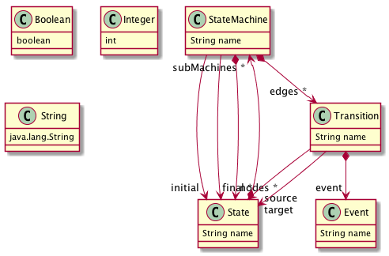

with the following constraint, ensuring the consistency of event names:

	context Transition
	inv event_consistency:
	not(self.event.oclIsUndefined) implies self.name=self.event.name

For which we can define state machines as follows:

The questions that we address next are:
* Can we reuse the model operation for compiling state machines that conform to **version 2** of the metamodel (as the one depicted above)? 
* If so, how can we do it?

Our subtyping operation assists us in determining that the **version 2** of the metamodel together with the OCL constraint is a refinement of **version 1** as shown [in this test case](./subtyping.tests/src/test/groovy/metamodel/sm/ModelTypeUtils_reuse_tests.groovy), which is not due to the removal of the **Observation** concept. By looking at the generated binding file and at completement of the supertype metamodel (shown below), the modeller has information to find out that the source of the problem. 

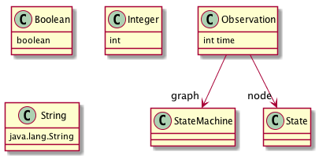

To see if there exists a potential valid refinement for reusing the operation, the user can extract the effective metamodel for the ATL transformation, either:
* **manually** by using the software artifacts generated by out tool and by inspecting the ATL transformation, which seems reasonable for an example of this size; or
* **automatically** by using tools like [anATLyzer](http://sanchezcuadrado.es/projects/anatlyzer/) that perform static analysis of ATL transformations.

Our tool provides a facility for prunning a metamodel given the relevant features. The computed [effective metamodel](./fma.metamodel.subtyping/src/test/groovy/sle17/sm/evolution/smObservation_prunned.emf) is as follows:

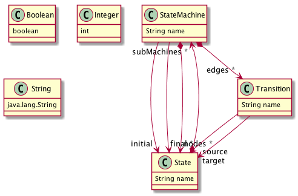

The subtyping operation is used again to check whether the effective metamodel is a valid supertype for our metamodel (version 2), which is correct.

The subtyping operation also synthesizes: 
* the [extension metamodel](./subtyping.sm.atl.evolution/extended/binding0_reuse_mm.ecore), depicted in class diagram notation as follows

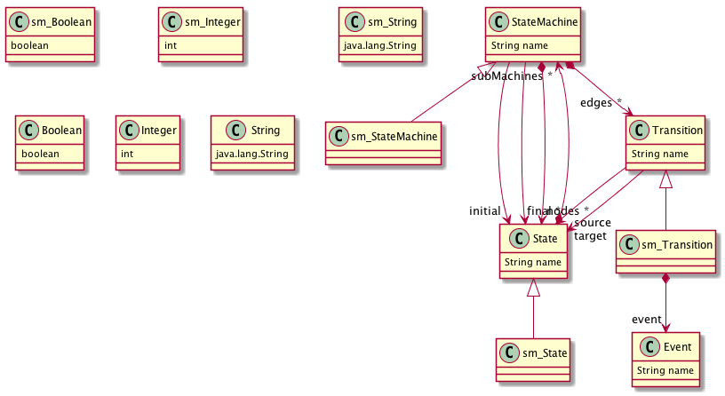

* and the complement of the supertype and subtype metamodels. The complement of the subtype metamodel (shown below) tells us that the models of the subtype are only **partially typed** with the supertype metamodel, as the class *Event* is not covered.

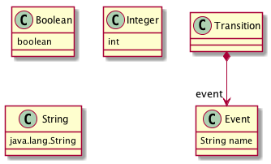s

That can be used to rewrite the signature of the model management operation. In addition, as the subtyping operation had to apply some automatic renamings in order to avoid name clashes, we have to adapt the original model that conforms to **version 2** to the extension metamodel as shown in the test case [test_evolution_scenario](./subtyping.tests/src/test/groovy/metamodel/sm/test_sle17_evolution.groovy). This operation retypes the objects in the original model according to the renamings inferred by the subtyping operation: 

This model can be processed by the ATL transformation, after replacing the original metamodel with the synthesized extension metamodel. Note that the adaptation of the model is only mandatory when the set of class names in version 1 and the set of class names in version 2 are not disjoint. 

In case the renamings applied to the subtype metamodel in the extension model make the object type names different from those in the original subtype metamodel, the tool facilitates an adaptation from the extended metamodel to the original metamodel as shown in [the test case (testRetype_smEvent_asOriginal)](./subtyping.tests/src/test/groovy/metamodel/sm/ModelTypeUtils_reuse_tests.groovy). 

### Scenario 4: Stepwise Simulation of Deterministic State Machines (Reuse, Dynamic Typing)

In this example, we are considering the reuse of an ATL transformation used in the paper for simulating deterministic state machines stepwise by using an ATL transformation that applies a function graph to a node. The difference with the evolution example is that the simulation example generates new elements in the transformation, which are automatically re-typed in our approach, illustrating how **dynamic typing** is supported.

The steps in the scenario described below have been implemented in the test case [test_simulation_scenario](./fma/metamodel/subtyping/src/test/groovy/fma/metamodel/subtyping/utils/tests/test_sle17_sm_simulation.groovy). The resources used in the scenario are reachable from the implementation of the test case.

* The graph metamodel that has been considered is

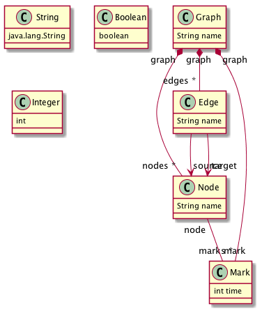

* with the well-formedness constraints

	context Edge
	inv map:
	not(Edge.allInstances()->exists(e | 
		e.source=self.source
		and
		e.target<>self.target 
	))
	

* The [ATL transformation](./subtyping.sm.atl.simulation/trafo/simulation_sm.atl), shown below, applies a marking to the nodes of the graph by following the order imposed by the edges of the function graph.

	module simulation;
	create OUT : graph refining IN : graph;
	
	rule simulate {
		from 
			n1 : graph!State ( n1.mark.oclIsUndefined() and graph!Transition.allInstances()->exists( e | e.target=n1 and not e.source.mark.oclIsUndefined()) ) 
		to
			n2 : graph!State (
				mark <- m		
			),
			m : graph!Observation (
				graph <- n1.graph,
				time <- graph!Transition.allInstances()->select( e | e.target=n1 and not e.source.mark.oclIsUndefined())->asSequence()->first().source.mark.time + 1
			)	
	}

* An initial graph and the resulting graphs from applying the transformation twice, that is once to the input model and a second time to the model generated after step 1, would be as follows:

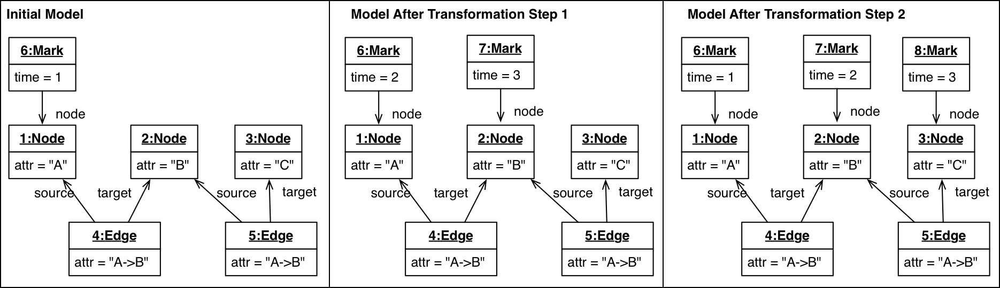

In these models, we have obliterated the root object *Graph*.
  
As discussed in the paper, the ATL transformation could be applicable to deterministic state machines to facilitate their simulation.  The state machine metamodel that we are considering is

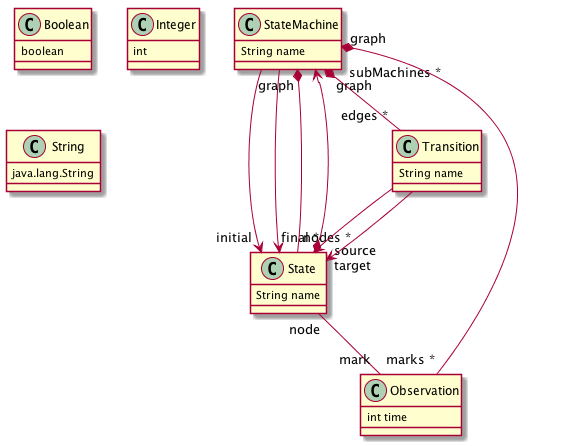

with the well-formedness constraints

	context Transition
	inv determinism:
	not(Transition.allInstances()->exists(t | 
		t.source=self.source
		and
		t.target<>self.target 
	))

To reuse the ATL transformation, we use the subtyping operation to obtain the reuse metamodel:

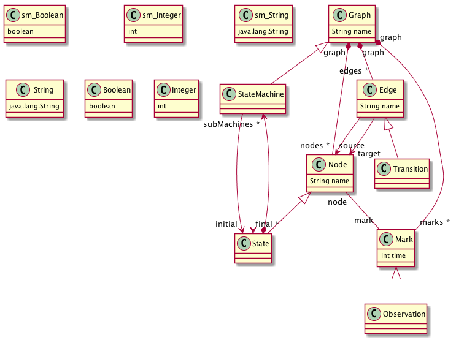

In addition, we can check that the complement of the supertype metamodel only contains datatypes, indicating that all the supertype classifiers are covered by the subtyping relation and, hence, that the metamodel graph is indeed a supertype of the deterministic state machine metamodel specification.

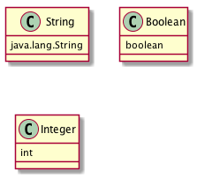

And that the complement of the subtype metamodel contains the references `initial`, `final` and `subMachines` between the classes `State` and `StateMachine`, indicating 

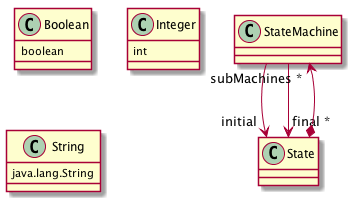

To **reuse** the ATL transformation for the state machines, the model representing the state machine needs to be re-typed to the extension metamodel, obtaining a model conforming to the extension metamodel, to which the ATL transformation can be applied. After applying the ATL transformation, another model conforming to the extension metamodel is obtained where concepts from the supertype may have been created (as `Mark`). A second re-typing is necessary in order to ensure that the produced model conforms to the original state machine metamodel. This process is illustrated as follows:

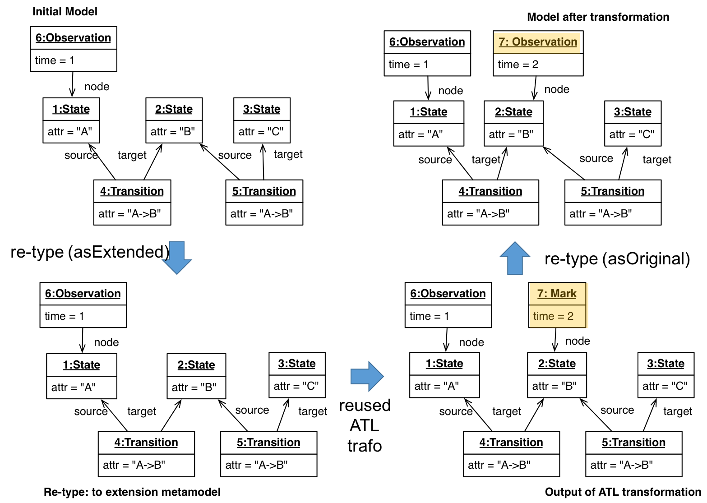

As discussed in the paper, the subtyping relation must be strict in order for the re-typing to work automatically. 

## License

MIT License

Copyright (c) 2017 Artur Boronat

Permission is hereby granted, free of charge, to any person obtaining a copy
of this software and associated documentation files (the "Software"), to deal
in the Software without restriction, including without limitation the rights
to use, copy, modify, merge, publish, distribute, sublicense, and/or sell
copies of the Software, and to permit persons to whom the Software is
furnished to do so, subject to the following conditions:

The above copyright notice and this permission notice shall be included in all
copies or substantial portions of the Software.

THE SOFTWARE IS PROVIDED "AS IS", WITHOUT WARRANTY OF ANY KIND, EXPRESS OR
IMPLIED, INCLUDING BUT NOT LIMITED TO THE WARRANTIES OF MERCHANTABILITY,
FITNESS FOR A PARTICULAR PURPOSE AND NONINFRINGEMENT. IN NO EVENT SHALL THE
AUTHORS OR COPYRIGHT HOLDERS BE LIABLE FOR ANY CLAIM, DAMAGES OR OTHER
LIABILITY, WHETHER IN AN ACTION OF CONTRACT, TORT OR OTHERWISE, ARISING FROM,
OUT OF OR IN CONNECTION WITH THE SOFTWARE OR THE USE OR OTHER DEALINGS IN THE
SOFTWARE.

## Credits

Our tool reuses (adapting and extending) the following third-party tools as libraries:

* [TOTEM-MDE](https://github.com/totem-mde/totem): for integrating the USE validator with EMF.
* [USE validator](https://sourceforge.net/projects/useocl/) to reason about OCL constraints.
* Maude4J: An Eclipse-independent version of [Maude Development Tools](http://mdt.sourceforge.net/) for integrating Maude with Java.